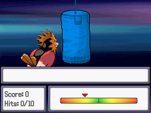
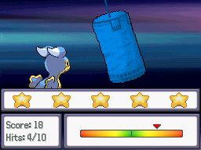

# Punch Bag Game
This script is for Pokémon Essentials. The player select a pokémon for a simple minigame where he gains points the closer to the center the cursor is when the button is pressed. EVs and IVs can be the rewards.

## Screens

## Installation
Follow the [Script](/Script.rb) instructions. The sample script files are in [Files folder](/Files).